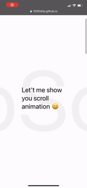

<h1 align="center">🎞 react-scroll-motion ✨</h1>
<p>
  <a href="https://www.npmjs.com/package/react-scroll-motion" target="_blank">
    
  </a>
  <a href="https://github.com/1000ship/react-scroll-motion#readme" target="_blank">
    
  </a>
  <a href="https://github.com/1000ship/react-scroll-motion/graphs/commit-activity" target="_blank">
    
  </a>
  <a href="https://github.com/1000ship/react-scroll-motion/blob/master/LICENSE" target="_blank">
    
  </a>
</p>


> Easy to make scroll animation with ReactJS

## Install

```sh
# Use npm
npm install react-scroll-motion

# Use yarn
yarn add react-scroll-motion
```

## Code Preview

| PC                                                           | Mobile                                                       |
| ------------------------------------------------------------ | ------------------------------------------------------------ |
|  |  |

- [View on deployed example](https://1000ship.github.io/react-scroll-motion/)

```jsx
import { Animator, ScrollContainer, ScrollPage, batch, Fade, FadeIn, Move, MoveIn, MoveOut, Sticky, StickyIn, ZoomIn } from "react-scroll-motion";

const ZoomInScrollOut = batch(StickyIn(), FadeIn(), ZoomIn());
const FadeUp = batch(Fade(), Move(), Sticky());

<ScrollContainer>
  <ScrollPage page={0}>
    <Animator animation={batch(Fade(), Sticky(), MoveOut(0, -200))}>
      <span style={{ fontSize: "30px" }}>Let me show you scroll animation 😀</span>
    </Animator>
  </ScrollPage>
  <ScrollPage page={1}>
    <Animator animation={ZoomInScrollOut}>
      <span style={{ fontSize: "40px" }}>I'm FadeUpScrollOut ✨</span>
    </Animator>
  </ScrollPage>
  <ScrollPage page={2}>
    <Animator animation={FadeUp}>
      <span style={{ fontSize: "40px" }}>I'm FadeUp ⛅️</span>
    </Animator>
  </ScrollPage>
  <ScrollPage page={3}>
    <div style={{ display: "flex", justifyContent: "center", alignItems: "center", height: "100%" }} >
      <span style={{ fontSize: "40px" }}>
        <Animator animation={MoveIn(-1000, 0)}>Hello Guys 👋🏻</Animator>
        <Animator animation={MoveIn(1000, 0)}>Nice to meet you 🙋🏻‍♀️</Animator>- I'm Seonghyeok -
        <Animator animation={MoveOut(1000, 0)}>Good bye ✋🏻</Animator>
        <Animator animation={MoveOut(-1000, 0)}>See you 💛</Animator>
      </span>
    </div>
  </ScrollPage>
  <ScrollPage page={4}>
    <Animator animation={batch(Fade(), Sticky())}>
      <span style={{ fontSize: "40px" }}>Done</span>
      <br/>
      <span style={{ fontSize: "30px" }}>
        There's FadeAnimation, MoveAnimation, StickyAnimation, ZoomAnimation
      </span>
    </Animator>
  </ScrollPage>
</ScrollContainer>
```

## Notes & References

- [Simple Docs (BETA)](_readme/docs.md)
- [Update Notes](_readme/update.md)

## Author

👤 **Seonghyeok Chun**

* Website: 1000ship.me
* Github: [@1000ship](https://github.com/1000ship)

## 🤝 Contributing

Contributions, issues and feature requests are welcome!<br />Feel free to check [issues page](https://github.com/1000ship/react-scroll-motion/issues). 

## Show your support

Give a ⭐️ if this project helped you!

## 📝 License

Copyright © 2021 [Seonghyeok Chun](https://github.com/1000ship).<br />
This project is [MIT](https://github.com/1000ship/react-scroll-motion/blob/master/LICENSE) licensed.

***
_This README was generated with ❤️ by [readme-md-generator](https://github.com/kefranabg/readme-md-generator)_
